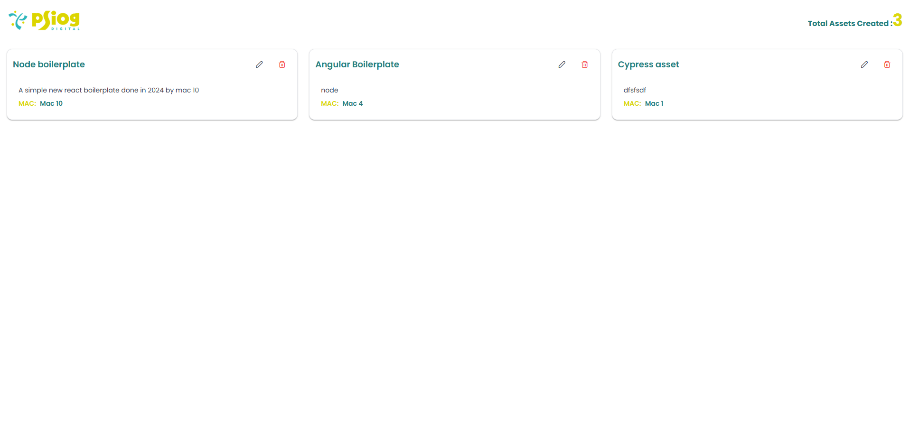
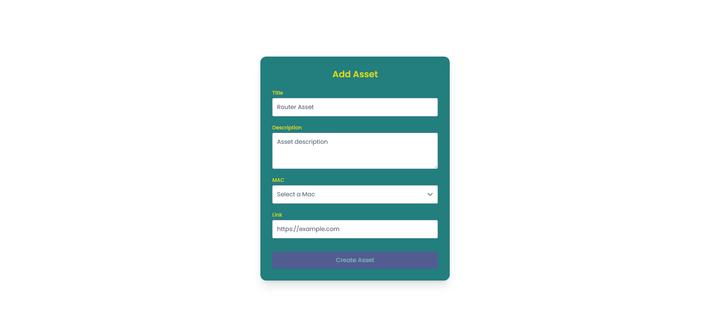
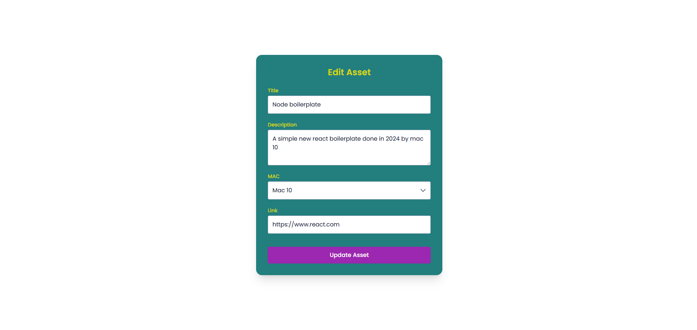

# AssetLibrary

AssetLibrary is an Angular application built to create, manage, and view assets.  
It follows a modular, component-driven architecture with services for authentication, state management, and API interaction.

This project was generated using **Angular CLI v20.3.9**.

---

## 🚀 Features

- Asset creation and management
- Authentication (login / signup)
- Route guards & HTTP interceptors
- Centralized state management for assets
- Responsive UI using Tailwind CSS
- Modular and scalable folder structure

## 🧠 Architecture Overview

- **Components** handle UI rendering and user interaction
- **Containers** manage feature-level logic (e.g., Add Asset)
- **Services** handle:
  - API communication
  - Authentication
  - State management
- **Guards & Interceptors** enforce authentication and secure routes

---

## 🛠️ Development Server

Run the application locally:

```bash
npm install
ng run start
```

## 🖼️ Application Screenshots

Below are some screenshots showcasing the UI and features of the AssetLibrary application.

### Home & Asset Views



### Add Asset Flow



### Edit Asset Flow



### Authentication / Navigation


